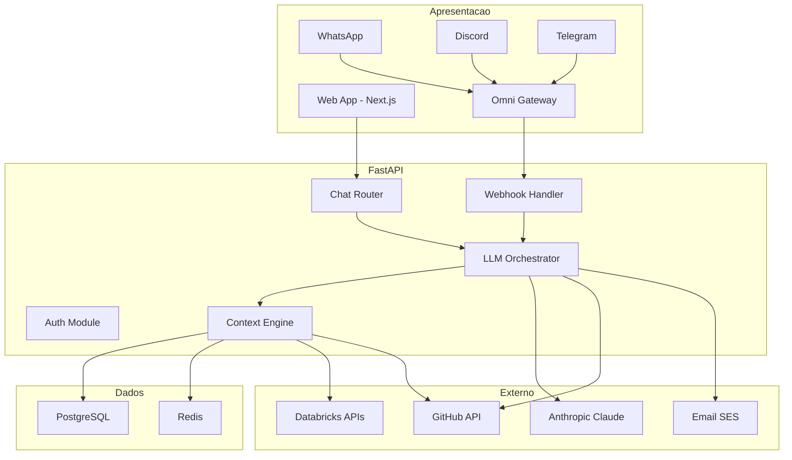

# Plataforma Conversacional para Pipeline Medallion — Especificacao Tecnica

## 1. Visao Geral

### 1.1 O Que E

Uma plataforma conversacional que permite a operadores, engenheiros de dados e gestores interagirem com pipelines Medallion (Bronze, Silver, Gold) atraves de linguagem natural. O usuario conversa com um agente de IA que tem acesso completo ao estado do pipeline, historico de execucoes, schemas das tabelas Delta, codigo dos notebooks e metricas — e pode executar acoes concretas como criar pull requests, disparar execucoes, modificar configuracoes e gerar relatorios.

### 1.2 Por Que Existe

O pipeline Medallion ja possui um agente autonomo (`agent_pre.py` + `agent_post.py`) que monitora execucoes, faz rollback automatico via Delta e envia notificacoes. Porem, a interacao humana ainda depende de: (a) acessar o Databricks manualmente, (b) ler logs em tabelas Delta, (c) abrir PRs no GitHub, (d) consultar metricas em dashboards separados. A plataforma conversacional unifica todas essas interacoes em uma interface unica, onde o usuario faz perguntas e solicita acoes em linguagem natural, e o agente executa com contexto completo do pipeline.

### 1.3 Principios Arquiteturais

- **Context-First**: toda interacao do LLM recebe contexto relevante do pipeline antes de responder
- **Action-Oriented**: o agente nao apenas responde perguntas — ele executa acoes (PRs, runs, configs)
- **Company-Scoped Isolation**: cada empresa ve apenas seus pipelines, com isolamento completo de dados
- **Channel-Agnostic**: a mesma logica de agente funciona via web, WhatsApp, Discord ou Telegram
- **Persistent Conversations**: cada pipeline run tem seu thread de conversa com historico completo

---

## 2. Arquitetura de Alto Nivel

### 2.1 Diagrama de Componentes

```
+-------------------------------------------------------------------------+
|                     CAMADA DE APRESENTACAO                               |
|                                                                         |
|  +------------+  +------------+  +------------+  +------------+         |
|  | Web App    |  | WhatsApp   |  | Discord    |  | Telegram   |         |
|  | (Next.js)  |  | (via Omni) |  | (via Omni) |  | (via Omni) |         |
|  +-----+------+  +-----+------+  +-----+------+  +-----+------+         |
|        |               |               |               |                |
|        |               +-------+-------+               |                |
|        v                       v                       v                |
|  +------------+         +--------------+                                |
|  | Web API    |         | Omni Gateway |                                |
|  | (direto)   |         | (webhook)    |                                |
|  +-----+------+         +------+-------+                                |
+---------+----------------------+----------------------------------------+
          |                      |
          v                      v
+-------------------------------------------------------------------------+
|                        CAMADA DE API (FastAPI)                           |
|                                                                         |
|  +----------+  +----------+  +-------------------+                      |
|  | Auth     |  | Chat     |  | Webhook Handler   |                      |
|  | Module   |  | Router   |  | (Omni + Pipeline) |                      |
|  +----------+  +----+-----+  +---------+---------+                      |
|                     |                  |                                 |
|                     v                  v                                 |
|              +------------------------------+                           |
|              |     LLM Orchestrator          |                           |
|              |  (routing, tools, streaming)  |                           |
|              +--------------+---------------+                           |
|                             |                                           |
|                             v                                           |
|              +------------------------------+                           |
|              |      Context Engine           |                           |
|              |  (assembly, ranking, cache)   |                           |
|              +------------------------------+                           |
+-------------------------------------------------------------------------+
          |                      |                      |
          v                      v                      v
+----------------+    +----------------+    +----------------+
| Databricks     |    | GitHub         |    | Anthropic      |
| APIs           |    | API            |    | Claude API     |
|                |    |                |    |                |
| - Jobs API     |    | - Repos API    |    | - Messages     |
| - SQL API      |    | - PRs API      |    | - Tool Use     |
| - Unity Catalog|    | - Contents API |    | - Streaming    |
| - Clusters API |    | - Actions API  |    |                |
+----------------+    +----------------+    +----------------+
```

### 2.2 Diagrama Mermaid



---

## 3. Componentes

### 3.1 Frontend (Next.js)

#### Estrutura de Paginas

```
/                        → Redirect para /chat ou /login
/login                   → Login com email/senha ou OAuth
/chat                    → Lista de pipelines + thread mais recente
/chat/:pipeline_id       → Threads de conversa do pipeline
/chat/:pipeline_id/:id   → Conversa especifica
/settings                → Configuracoes da conta
/admin                   → Gestao de usuarios e empresas
```

#### Componentes Principais

```
src/
├── app/
│   ├── (auth)/login/page.tsx
│   ├── (dashboard)/
│   │   ├── layout.tsx              # Sidebar + chat area
│   │   └── chat/[pipelineId]/[threadId]/page.tsx
├── components/
│   ├── chat/
│   │   ├── ChatWindow.tsx          # Container principal
│   │   ├── MessageList.tsx         # Lista com scroll
│   │   ├── MessageBubble.tsx       # Mensagem user/agent
│   │   ├── StreamingMessage.tsx    # SSE streaming
│   │   ├── ActionCard.tsx          # Card de acao (PR criado, run disparado)
│   │   └── CodeBlock.tsx           # Syntax highlight
│   ├── sidebar/
│   │   ├── PipelineList.tsx        # Lista de pipelines
│   │   ├── ThreadList.tsx          # Threads por pipeline
│   │   └── PipelineStatus.tsx      # Badge de status
│   └── pipeline/
│       ├── PipelineOverview.tsx
│       └── SchemaViewer.tsx
├── hooks/
│   ├── useChat.ts                  # SSE + estado do chat
│   ├── usePipeline.ts
│   └── useAuth.ts
└── types/
    ├── chat.ts
    ├── pipeline.ts
    └── user.ts
```

#### Streaming de Respostas (SSE)

```typescript
interface ChatMessage {
  id: string;
  role: "user" | "assistant";
  content: string;
  actions?: ActionResult[];
  timestamp: string;
}

interface ActionResult {
  type: "pr_created" | "run_triggered" | "query_executed";
  status: "success" | "failed";
  details: Record<string, any>;
}

// Eventos SSE:
// event: token    → {"content": "A Silver falhou porque..."}
// event: action   → {"type": "query_executed", "details": {...}}
// event: done     → {"message_id": "msg_abc123"}
```

### 3.2 Backend API (FastAPI)

#### Estrutura

```
backend/
├── main.py
├── config.py                       # pydantic-settings
├── routers/
│   ├── auth.py                     # login, register, refresh
│   ├── chat.py                     # message (SSE), threads
│   ├── pipelines.py                # status, runs, schemas
│   ├── webhooks.py                 # omni callbacks, pipeline events
│   └── admin.py                    # CRUD usuarios, empresas
├── services/
│   ├── llm_orchestrator.py         # Orquestracao LLM + tools
│   ├── context_engine.py           # Montagem de contexto
│   ├── databricks_service.py       # Integracao Databricks
│   ├── github_service.py           # Integracao GitHub
│   ├── omni_service.py             # Multi-canal
│   └── notification_service.py     # Email SES
├── models/
│   ├── database.py                 # SQLAlchemy models
│   └── schemas.py                  # Pydantic request/response
├── tools/                          # Tools do LLM
│   ├── databricks_tools.py         # query_table, get_status, trigger_run
│   ├── github_tools.py             # create_pr, read_file
│   ├── analysis_tools.py           # generate_report
│   └── notification_tools.py       # send_email
├── middleware/
│   ├── auth_middleware.py
│   └── rate_limit.py
└── tests/
```

#### Endpoints

```
POST   /auth/login              → JWT token
POST   /auth/register           → Criar conta
POST   /auth/refresh            → Renovar token

GET    /pipelines               → Listar pipelines da empresa
GET    /pipelines/:id/status    → Status atual
GET    /pipelines/:id/runs      → Historico
GET    /pipelines/:id/schemas   → Schemas Delta

POST   /chat/message            → Enviar mensagem (retorna SSE)
GET    /chat/threads            → Listar threads
GET    /chat/threads/:id        → Mensagens de um thread
POST   /chat/threads            → Criar novo thread

POST   /webhooks/omni           → Mensagens WhatsApp/Discord/Telegram
POST   /webhooks/pipeline       → Eventos do pipeline agent
```

#### Modelo de Dados (PostgreSQL)

```sql
CREATE TABLE companies (
    id UUID PRIMARY KEY,
    name VARCHAR(255) NOT NULL,
    slug VARCHAR(100) UNIQUE NOT NULL,
    databricks_host VARCHAR(500),
    databricks_token_encrypted BYTEA,
    github_org VARCHAR(255),
    settings JSONB DEFAULT '{}'
);

CREATE TABLE users (
    id UUID PRIMARY KEY,
    company_id UUID REFERENCES companies(id),
    email VARCHAR(255) UNIQUE NOT NULL,
    password_hash VARCHAR(255),
    name VARCHAR(255) NOT NULL,
    role VARCHAR(50) DEFAULT 'viewer',  -- admin | editor | viewer
    is_active BOOLEAN DEFAULT TRUE
);

CREATE TABLE pipelines (
    id UUID PRIMARY KEY,
    company_id UUID REFERENCES companies(id),
    name VARCHAR(255) NOT NULL,
    databricks_job_id BIGINT,
    github_repo VARCHAR(500),
    config JSONB DEFAULT '{}'
);

CREATE TABLE threads (
    id UUID PRIMARY KEY,
    pipeline_id UUID REFERENCES pipelines(id),
    user_id UUID REFERENCES users(id),
    title VARCHAR(500),
    channel VARCHAR(50) DEFAULT 'web',  -- web | whatsapp | discord | telegram
    is_active BOOLEAN DEFAULT TRUE,
    created_at TIMESTAMPTZ DEFAULT NOW()
);

CREATE TABLE messages (
    id UUID PRIMARY KEY,
    thread_id UUID REFERENCES threads(id),
    role VARCHAR(20) NOT NULL,          -- user | assistant | system | tool
    content TEXT NOT NULL,
    actions JSONB DEFAULT '[]',
    token_count INTEGER,
    model VARCHAR(100),
    created_at TIMESTAMPTZ DEFAULT NOW()
);

CREATE TABLE pipeline_context_cache (
    id UUID PRIMARY KEY,
    pipeline_id UUID REFERENCES pipelines(id),
    context_type VARCHAR(50) NOT NULL,  -- schema | run_history | code | metrics
    content JSONB NOT NULL,
    token_estimate INTEGER,
    updated_at TIMESTAMPTZ DEFAULT NOW(),
    UNIQUE(pipeline_id, context_type)
);
```

### 3.3 Context Engine

O componente mais critico. Coleta, ranqueia e injeta contexto do pipeline no LLM.

#### Fontes de Contexto

| Tipo | Fonte | TTL Cache | Tokens |
|------|-------|-----------|--------|
| `pipeline_state` | Databricks Jobs API | 60s | 200-500 |
| `recent_errors` | Databricks Logs | 60s | 500-2000 |
| `table_schemas` | Unity Catalog | 300s | 1000-3000 |
| `run_history` | Jobs API (ultimas 10) | 120s | 500-1500 |
| `notebook_code` | GitHub Contents API | 600s | 2000-8000 |
| `conversation_history` | PostgreSQL | N/A | variavel |

#### Token Budget (80k max)

```python
class ContextEngine:
    MAX_CONTEXT_TOKENS = 80_000
    RESERVED_CONVERSATION = 15_000
    RESERVED_SYSTEM = 3_000

    def assemble_context(self, pipeline_id, thread_id, user_message):
        available = self.MAX_CONTEXT_TOKENS - self.RESERVED_CONVERSATION - self.RESERVED_SYSTEM

        # 1. Classificar intent (status_check, error_diagnosis, change_request, etc.)
        intent = self._classify_intent(user_message)

        # 2. Ajustar prioridades por intent
        # error_diagnosis → peso alto para errors + code
        # report_request → peso alto para metrics

        # 3. Coletar contexto (cache ou API)
        # 4. Ranquear por prioridade
        # 5. Montar ate caber no budget
```

#### Cache em 3 Camadas

```
L1: Redis (60s)    → pipeline_state, recent_errors
L2: PostgreSQL (5min) → table_schemas, run_history, metrics
L3: S3 (1h)        → notebook_code, full_execution_logs
```

### 3.4 LLM Orchestrator — Tools do Agente

```python
TOOLS = [
    # Databricks
    {"name": "get_pipeline_status", ...},
    {"name": "get_run_logs", ...},
    {"name": "query_delta_table", ...},   # SELECT apenas
    {"name": "trigger_pipeline_run", ...}, # Requer confirmacao
    {"name": "get_table_schema", ...},

    # GitHub
    {"name": "read_file", ...},
    {"name": "create_pull_request", ...}, # Requer confirmacao
    {"name": "list_recent_prs", ...},

    # Analise
    {"name": "generate_chart_data", ...},

    # Notificacao
    {"name": "send_notification", ...},   # Requer confirmacao
]
```

Acoes perigosas (trigger_run, create_pr, send_notification) requerem confirmacao do usuario antes de executar.

### 3.5 Multi-Canal (Omni)

```
WhatsApp ──┐
Discord  ──┼── Omni Gateway ── POST /webhooks/omni ── FastAPI ── LLM
Telegram ──┘       │
                   │◄── POST /omni/send ◄── FastAPI (resposta)
```

| Feature | Web | WhatsApp | Discord | Telegram |
|---------|-----|----------|---------|----------|
| Streaming | SSE | Nao | Parcial | Nao |
| Code blocks | Syntax highlight | Texto puro | Markdown | Markdown |
| Max mensagem | Ilimitado | 4096 chars | 2000 chars | 4096 chars |
| Confirmacao | Botao | Quick reply | Button | Inline keyboard |

### 3.6 Auth (RBAC)

| Acao | viewer | editor | admin |
|------|--------|--------|-------|
| Ver status | Sim | Sim | Sim |
| Conversar | Sim | Sim | Sim |
| Solicitar PRs | Nao | Sim | Sim |
| Disparar runs | Nao | Sim | Sim |
| Gerenciar usuarios | Nao | Nao | Sim |

JWT com `company_id` no payload. Toda query filtra por `company_id` via middleware.

---

## 4. Fluxos de Dados

### 4.1 "Por que a Silver falhou ontem?"

```
1. Usuario digita no chat
2. Context Engine classifica intent: "error_diagnosis"
3. Busca: runs recentes, logs stderr, schema Silver, codigo do notebook
4. LLM recebe ~40k tokens de contexto + tools
5. LLM chama get_run_logs(task="silver_dedup", log_type="stderr")
6. Backend executa, retorna logs
7. LLM analisa e responde com diagnostico completo
8. Resposta streaming via SSE
```

### 4.2 "Cria uma tabela Gold de sentimento por agente"

```
1. Context Engine carrega: schemas Gold, notebook analytics.py
2. LLM projeta schema, escreve codigo PySpark
3. LLM chama create_pull_request com branch + arquivos + descricao
4. Backend cria PR no GitHub
5. LLM responde: "PR #52 criado. Quer que eu dispare um teste?"
6. Se usuario confirma, LLM chama trigger_pipeline_run
```

### 4.3 WhatsApp: "status do pipeline"

```
1. Omni recebe mensagem, envia webhook
2. Backend identifica usuario pelo numero
3. Context compacto (resposta curta para WhatsApp)
4. LLM responde conciso: "Pipeline OK. 15k registros. Proxima run amanha 03:00"
5. Resposta via Omni → WhatsApp
```

---

## 5. Stack Tecnologica

### Frontend

| Tecnologia | Justificativa |
|-----------|---------------|
| Next.js 15 | App Router, SSR, streaming nativo |
| TypeScript | Type safety obrigatoria |
| Tailwind CSS + shadcn/ui | UI rapida e consistente |
| Recharts | Graficos inline no chat |

### Backend

| Tecnologia | Justificativa |
|-----------|---------------|
| FastAPI | Async nativo, SSE, OpenAPI auto |
| Python 3.12+ | Performance, typing |
| SQLAlchemy 2 + Alembic | ORM async + migracoes |
| anthropic SDK | Tool use + streaming |
| httpx | Cliente HTTP async |
| tiktoken | Estimativa de tokens |

### Infra

| Tecnologia | Justificativa |
|-----------|---------------|
| PostgreSQL 16 | Relacional + JSONB |
| Redis 7 | Cache L1 + sessoes |
| ECS Fargate | Serverless containers (SSE long-lived) |
| ALB | Load balancer com SSE |
| S3 | Cache L3 + artefatos |
| SES | Email transacional |
| Terraform | IaC |

---

## 6. Requisitos de Infraestrutura AWS

```
VPC (10.0.0.0/16)
├── Public Subnets (2 AZs)
│   └── ALB (HTTPS :443, SSE)
├── Private Subnets (2 AZs)
│   ├── ECS Fargate (2-8 tasks, 1vCPU, 2GB)
│   ├── RDS PostgreSQL 16 (db.t4g.medium, Multi-AZ)
│   └── ElastiCache Redis 7 (cache.t4g.micro)
├── S3 (artefatos)
├── SES (email)
├── Secrets Manager (API keys)
└── CloudWatch (logs + metricas)
```

Custo estimado: ~$270/mes (AWS) + ~$1500/mes (Anthropic API a 100 msgs/dia)

---

## 7. Seguranca

- **Auth**: JWT RS256, httpOnly cookies, refresh token rotacionado
- **API Keys**: AWS Secrets Manager (nunca no banco, nunca em logs)
- **Multi-tenant**: `WHERE company_id = :cid` em toda query, via middleware
- **LLM**: SQL validation (apenas SELECT), tool confirmation, output filtering
- **Webhooks**: HMAC signature validation
- **TLS**: 1.3 obrigatorio

---

## 8. MVP vs Full

### MVP (4-6 semanas)

- Chat basico Next.js + FastAPI
- Login email/senha, single-tenant
- 3 tools LLM (status, query, logs)
- SQLite local, sem Redis
- Docker Compose

### V1 (semanas 7-12)

- PostgreSQL + Redis + ECS
- Todas as tools + confirmacao
- WhatsApp via Omni
- Multi-tenant basico
- CI/CD

### V2 (semanas 13-20)

- Discord + Telegram
- Graficos inline
- Agente proativo
- MFA, audit logs
- Auto-scaling
