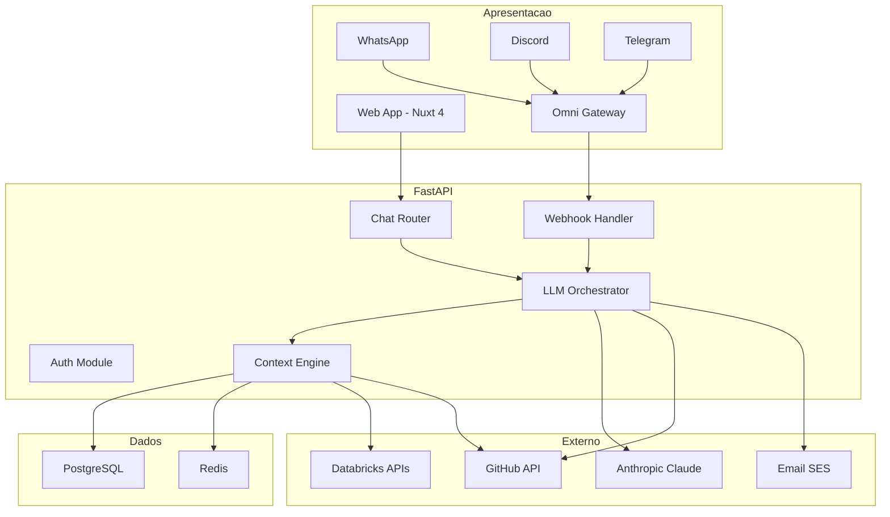

# Plataforma Conversacional para Pipeline Medallion — Especificacao Tecnica

## 1. Visao Geral

### 1.1 O Que E

Uma plataforma conversacional que permite a operadores, engenheiros de dados e gestores interagirem com pipelines Medallion (Bronze, Silver, Gold) atraves de linguagem natural. O usuario conversa com um agente de IA que tem acesso completo ao estado do pipeline, historico de execucoes, schemas das tabelas Delta, codigo dos notebooks e metricas — e pode executar acoes concretas como criar pull requests, disparar execucoes, modificar configuracoes e gerar relatorios.

### 1.2 Por Que Existe

O pipeline Medallion ja possui um agente autonomo (`agent_pre.py` + `agent_post.py`) que monitora execucoes, faz rollback automatico via Delta e envia notificacoes. Porem, a interacao humana ainda depende de: (a) acessar o Databricks manualmente, (b) ler logs em tabelas Delta, (c) abrir PRs no GitHub, (d) consultar metricas em dashboards separados. A plataforma conversacional unifica todas essas interacoes em uma interface unica, onde o usuario faz perguntas e solicita acoes em linguagem natural, e o agente executa com contexto completo do pipeline.

### 1.3 Principios Arquiteturais

- **Context-First**: toda interacao do LLM recebe contexto relevante do pipeline antes de responder
- **Action-Oriented**: o agente nao apenas responde perguntas — ele executa acoes (PRs, runs, configs)
- **Company-Scoped Isolation**: cada empresa ve apenas seus pipelines, com isolamento completo de dados
- **Channel-Agnostic**: a mesma logica de agente funciona via web, WhatsApp, Discord ou Telegram
- **Persistent Conversations**: cada pipeline run tem seu thread de conversa com historico completo

---

## 2. Arquitetura de Alto Nivel

### 2.1 Diagrama de Componentes

```
+-------------------------------------------------------------------------+
|                     CAMADA DE APRESENTACAO                               |
|                                                                         |
|  +------------+  +------------+  +------------+  +------------+         |
|  | Web App    |  | WhatsApp   |  | Discord    |  | Telegram   |         |
|  | (Nuxt 4)  |  | (via Omni) |  | (via Omni) |  | (via Omni) |         |
|  +-----+------+  +-----+------+  +-----+------+  +-----+------+         |
|        |               |               |               |                |
|        |               +-------+-------+               |                |
|        v                       v                       v                |
|  +------------+         +--------------+                                |
|  | Web API    |         | Omni Gateway |                                |
|  | (direto)   |         | (webhook)    |                                |
|  +-----+------+         +------+-------+                                |
+---------+----------------------+----------------------------------------+
          |                      |
          v                      v
+-------------------------------------------------------------------------+
|                        CAMADA DE API (FastAPI)                           |
|                                                                         |
|  +----------+  +----------+  +-------------------+                      |
|  | Auth     |  | Chat     |  | Webhook Handler   |                      |
|  | Module   |  | Router   |  | (Omni + Pipeline) |                      |
|  +----------+  +----+-----+  +---------+---------+                      |
|                     |                  |                                 |
|                     v                  v                                 |
|              +------------------------------+                           |
|              |     LLM Orchestrator          |                           |
|              |  (routing, tools, streaming)  |                           |
|              +--------------+---------------+                           |
|                             |                                           |
|                             v                                           |
|              +------------------------------+                           |
|              |      Context Engine           |                           |
|              |  (assembly, ranking, cache)   |                           |
|              +------------------------------+                           |
+-------------------------------------------------------------------------+
          |                      |                      |
          v                      v                      v
+----------------+    +----------------+    +----------------+
| Databricks     |    | GitHub         |    | Anthropic      |
| APIs           |    | API            |    | Claude API     |
|                |    |                |    |                |
| - Jobs API     |    | - Repos API    |    | - Messages     |
| - SQL API      |    | - PRs API      |    | - Tool Use     |
| - Unity Catalog|    | - Contents API |    | - Streaming    |
| - Clusters API |    | - Actions API  |    |                |
+----------------+    +----------------+    +----------------+
```

### 2.2 Diagrama Mermaid



---

## 3. Componentes

### 3.1 Frontend (Nuxt 4.4.2 + Vue 3)

#### UX: Modelo Claude Projects

A interface segue o padrao do Claude.ai Projects — sidebar com pipelines expandiveis em conversas:

```
┌──────────────────────────────┬───────────────────────────────────────────┐
│  SIDEBAR                     │  AREA DE CHAT                            │
│                              │                                          │
│  🔍 Buscar...                │  medallion-whatsapp-seguros > abc-123    │
│                              │                                          │
│  ▼ medallion-whatsapp-seguros│  ┌────────────────────────────────────┐  │
│    ● (SUCCESS)               │  │ 👤 quantas vendas fechamos ontem?  │  │
│    ├─ abc-123 (hoje, 10:30)  │  └────────────────────────────────────┘  │
│    │  "quantas vendas..."    │  ┌────────────────────────────────────┐  │
│    ├─ xyz-789 (ontem, 15:00) │  │ 🤖 47 vendas fechadas (taxa de    │  │
│    │  "por que a Silver..."  │  │    23%). Top agente: lucas_09.     │  │
│    └─ + Nova conversa        │  │                                    │  │
│                              │  │    [📊 Ver detalhes por agente]    │  │
│  ▶ etl-crm-diario           │  └────────────────────────────────────┘  │
│    ● (FAILED)                │                                          │
│                              │  ┌────────────────────────────────────┐  │
│  ▶ etl-financeiro            │  │ 👤 detalha por campanha           │  │
│    ● (RUNNING)               │  └────────────────────────────────────┘  │
│                              │  ┌────────────────────────────────────┐  │
│                              │  │ 🤖 ▊ (streaming...)               │  │
│                              │  └────────────────────────────────────┘  │
│                              │                                          │
│  ─────────────────────────── │  ┌────────────────────────────────────┐  │
│  ⚙ Configuracoes             │  │ 📎 Anexar | 📷 Print | ▶ Enviar  │  │
│  👤 Rodrigo (editor)         │  └────────────────────────────────────┘  │
└──────────────────────────────┴───────────────────────────────────────────┘
```

**Comportamento da sidebar:**
- Pipelines listados com badge de status (SUCCESS/FAILED/RUNNING)
- Clique no pipeline: expande lista de conversas do usuario (apenas as dele)
- Cada conversa mostra: UUID curto, data, preview da primeira mensagem
- Hover na conversa: botao de deletar
- "+ Nova conversa": cria thread novo para aquele pipeline
- Conversas ordenadas por ultima atividade (mais recente primeiro)
- Conversas de OUTROS canais (WhatsApp, Discord) tambem aparecem aqui
  (ex: conversa iniciada no WhatsApp aparece na sidebar web com icone do canal)

**Interacao com o chat:**
- Input suporta: texto, Shift+Enter (nova linha), arrastar arquivo/imagem
- Tipos de anexo: screenshots (png/jpg), CSVs, logs (.txt)
- Anexos sao enviados como base64 para o LLM (Claude suporta vision)
- Mensagens do agente renderizam: Markdown, code blocks (Shiki), tabelas, graficos
- Action cards: quando o agente cria um PR ou dispara um run, aparece um card clicavel
- Confirmacao inline: acoes perigosas mostram botao "Confirmar" / "Cancelar"

#### Estrutura de Paginas (file-based routing do Nuxt)

```
pages/
├── index.vue                          → Redirect para /chat ou /login
├── login.vue                          → Login com email/senha ou OAuth
├── chat/
│   ├── index.vue                      → Redirect para ultimo pipeline ativo
│   └── [pipelineId]/
│       ├── index.vue                  → Cria novo thread e redireciona
│       └── [threadId].vue             → Conversa (area principal)
├── settings.vue                       → Configuracoes da conta
└── admin/
    ├── index.vue                      → Dashboard admin
    ├── users.vue                      → Gestao de usuarios
    └── pipelines.vue                  → Gestao de pipelines
```

#### Componentes Principais

```
components/
├── chat/
│   ├── ChatWindow.vue              # Container principal (messages + input)
│   ├── MessageList.vue             # Lista com auto-scroll e lazy loading
│   ├── MessageBubble.vue           # Mensagem user/agent com Markdown
│   ├── StreamingMessage.vue        # Mensagem em construcao (SSE)
│   ├── ActionCard.vue              # Card: PR criado, run disparado, query executada
│   ├── ConfirmAction.vue           # Inline confirm/cancel para acoes perigosas
│   ├── CodeBlock.vue               # Syntax highlight (Shiki)
│   ├── AttachmentPreview.vue       # Preview de imagem/arquivo antes de enviar
│   └── ChatInput.vue               # Input com Shift+Enter, drag&drop, anexos
├── sidebar/
│   ├── SidebarLayout.vue           # Container da sidebar
│   ├── PipelineItem.vue            # Pipeline expandivel com badge de status
│   ├── ThreadItem.vue              # Conversa com preview, data, canal de origem
│   ├── ThreadActions.vue           # Menu: deletar, renomear, copiar UUID
│   ├── NewThreadButton.vue         # "+ Nova conversa"
│   └── SearchBar.vue               # Busca por pipeline ou conversa
├── pipeline/
│   ├── PipelineOverview.vue        # Status, metricas, ultimo run
│   ├── SchemaViewer.vue            # Schemas das Delta Tables
│   └── StatusBadge.vue             # Badge colorido (verde/vermelho/amarelo)
└── common/
    ├── ChannelIcon.vue             # Icone do canal (web/whatsapp/discord/telegram)
    └── LoadingDots.vue             # "Agente pensando..."

composables/
├── useChat.ts                      # SSE streaming + envio de mensagem
├── useSidebar.ts                   # Estado: pipeline expandido, thread selecionado
├── usePipelines.ts                 # Lista de pipelines + status (polling 30s)
├── useThreads.ts                   # CRUD de threads por pipeline
├── useAttachments.ts               # Upload de arquivos/imagens
└── useAuth.ts                      # Auth state + middleware

layouts/
├── default.vue                     # Sidebar + chat area (2 colunas)
├── auth.vue                        # Layout limpo para login/registro
└── admin.vue                       # Layout admin com nav diferente

middleware/
├── auth.ts                         # Redirect para /login se nao autenticado
└── role.ts                         # Verificar permissao (viewer/editor/admin)

server/
├── api/
│   └── proxy/[...].ts              # Proxy para FastAPI backend (SSE passthrough)

types/
├── chat.ts                         # Message, Thread, Attachment
├── pipeline.ts                     # Pipeline, Run, Table, Schema
└── user.ts                         # User, Company, Role
```

#### Streaming de Respostas (SSE via composable)

```typescript
// composables/useChat.ts

interface ChatMessage {
  id: string
  role: "user" | "assistant"
  content: string
  actions?: ActionResult[]
  attachments?: Attachment[]
  channel: "web" | "whatsapp" | "discord" | "telegram"
  timestamp: string
}

interface ActionResult {
  type: "pr_created" | "run_triggered" | "query_executed" | "confirmation_required"
  status: "success" | "failed" | "pending"
  details: Record<string, any>
}

interface Attachment {
  type: "image" | "file"
  name: string
  url: string
  mime_type: string
}

export function useChat(threadId: Ref<string>) {
  const messages = ref<ChatMessage[]>([])
  const isStreaming = ref(false)

  // Carregar historico (inclui mensagens de TODOS os canais)
  async function loadHistory() {
    const { data } = await useFetch(`/api/chat/threads/${threadId.value}/messages`)
    messages.value = data.value ?? []
  }

  // Enviar mensagem (com anexos opcionais)
  async function sendMessage(content: string, attachments?: File[]) {
    // Adicionar mensagem do usuario localmente
    const userMsg: ChatMessage = {
      id: crypto.randomUUID(),
      role: "user",
      content,
      channel: "web",
      attachments: attachments?.map(f => ({
        type: f.type.startsWith("image/") ? "image" : "file",
        name: f.name,
        url: URL.createObjectURL(f),
        mime_type: f.type,
      })),
      timestamp: new Date().toISOString(),
    }
    messages.value.push(userMsg)

    // Preparar FormData (para anexos)
    const formData = new FormData()
    formData.append("thread_id", threadId.value)
    formData.append("message", content)
    attachments?.forEach(f => formData.append("files", f))

    // Iniciar streaming da resposta
    isStreaming.value = true
    const assistantMsg = reactive<ChatMessage>({
      id: crypto.randomUUID(),
      role: "assistant",
      content: "",
      channel: "web",
      timestamp: new Date().toISOString(),
    })
    messages.value.push(assistantMsg)

    const response = await fetch("/api/chat/message", {
      method: "POST",
      body: formData,
    })

    const reader = response.body!.getReader()
    const decoder = new TextDecoder()

    while (true) {
      const { done, value } = await reader.read()
      if (done) break

      const chunk = decoder.decode(value)
      for (const line of chunk.split("\n")) {
        if (!line.startsWith("data: ")) continue
        const event = JSON.parse(line.slice(6))

        if (event.type === "token") {
          assistantMsg.content += event.content
        } else if (event.type === "action") {
          assistantMsg.actions = [...(assistantMsg.actions || []), event]
        } else if (event.type === "done") {
          assistantMsg.id = event.message_id
        }
      }
    }

    isStreaming.value = false
  }

  // Deletar thread
  async function deleteThread() {
    await useFetch(`/api/chat/threads/${threadId.value}`, { method: "DELETE" })
  }

  return { messages, isStreaming, loadHistory, sendMessage, deleteThread }
}
```

#### Composable da Sidebar

```typescript
// composables/useSidebar.ts

interface SidebarPipeline {
  id: string
  name: string
  status: "SUCCESS" | "FAILED" | "RUNNING" | "IDLE"
  threads: SidebarThread[]
  isExpanded: boolean
}

interface SidebarThread {
  id: string                  // UUID — pode ser usado no /resume cross-channel
  title: string               // Auto-gerado da primeira mensagem
  preview: string             // Primeiras ~50 chars da ultima mensagem
  channel: string             // Canal onde foi criado (icone visual)
  lastActivity: string        // "hoje, 10:30" / "ontem" / "3 dias atras"
  messageCount: number
}

export function useSidebar() {
  const pipelines = ref<SidebarPipeline[]>([])
  const activePipelineId = ref<string | null>(null)
  const activeThreadId = ref<string | null>(null)

  // Carregar pipelines + threads do usuario logado
  async function load() {
    const { data } = await useFetch("/api/pipelines?include_threads=true")
    pipelines.value = data.value?.map(p => ({
      ...p,
      isExpanded: p.id === activePipelineId.value,
    })) ?? []
  }

  // Expandir/colapsar pipeline
  function togglePipeline(pipelineId: string) {
    const p = pipelines.value.find(p => p.id === pipelineId)
    if (p) p.isExpanded = !p.isExpanded
  }

  // Criar nova conversa
  async function createThread(pipelineId: string) {
    const { data } = await useFetch("/api/chat/threads", {
      method: "POST",
      body: { pipeline_id: pipelineId },
    })
    await load() // Refresh sidebar
    return data.value // { id: "new-uuid", ... }
  }

  // Deletar conversa
  async function deleteThread(threadId: string) {
    await useFetch(`/api/chat/threads/${threadId}`, { method: "DELETE" })
    await load()
  }

  // Polling de status a cada 30s
  const { pause, resume } = useIntervalFn(load, 30_000)

  return {
    pipelines, activePipelineId, activeThreadId,
    load, togglePipeline, createThread, deleteThread,
    pausePolling: pause, resumePolling: resume,
  }
}
```

### 3.2 Backend API (FastAPI)

#### Estrutura

```
backend/
├── main.py
├── config.py                       # pydantic-settings
├── routers/
│   ├── auth.py                     # login, register, refresh
│   ├── chat.py                     # message (SSE), threads
│   ├── pipelines.py                # status, runs, schemas
│   ├── webhooks.py                 # omni callbacks, pipeline events
│   └── admin.py                    # CRUD usuarios, empresas
├── services/
│   ├── llm_orchestrator.py         # Orquestracao LLM + tools
│   ├── context_engine.py           # Montagem de contexto
│   ├── databricks_service.py       # Integracao Databricks
│   ├── github_service.py           # Integracao GitHub
│   ├── omni_service.py             # Multi-canal
│   └── notification_service.py     # Email SES
├── models/
│   ├── database.py                 # SQLAlchemy models
│   └── schemas.py                  # Pydantic request/response
├── tools/                          # Tools do LLM
│   ├── databricks_tools.py         # query_table, get_status, trigger_run
│   ├── github_tools.py             # create_pr, read_file
│   ├── analysis_tools.py           # generate_report
│   └── notification_tools.py       # send_email
├── middleware/
│   ├── auth_middleware.py
│   └── rate_limit.py
└── tests/
```

#### Endpoints

```
POST   /auth/login              → JWT token
POST   /auth/register           → Criar conta
POST   /auth/refresh            → Renovar token

GET    /pipelines               → Listar pipelines da empresa
GET    /pipelines/:id/status    → Status atual
GET    /pipelines/:id/runs      → Historico
GET    /pipelines/:id/schemas   → Schemas Delta

POST   /chat/message            → Enviar mensagem (retorna SSE)
GET    /chat/threads            → Listar threads
GET    /chat/threads/:id        → Mensagens de um thread
POST   /chat/threads            → Criar novo thread

POST   /webhooks/omni           → Mensagens WhatsApp/Discord/Telegram
POST   /webhooks/pipeline       → Eventos do pipeline agent
```

#### Modelo de Dados (PostgreSQL)

```sql
CREATE TABLE companies (
    id UUID PRIMARY KEY,
    name VARCHAR(255) NOT NULL,
    slug VARCHAR(100) UNIQUE NOT NULL,
    databricks_host VARCHAR(500),
    databricks_token_encrypted BYTEA,
    github_org VARCHAR(255),
    settings JSONB DEFAULT '{}'
);

CREATE TABLE users (
    id UUID PRIMARY KEY,
    company_id UUID REFERENCES companies(id),
    email VARCHAR(255) UNIQUE NOT NULL,
    password_hash VARCHAR(255),
    name VARCHAR(255) NOT NULL,
    role VARCHAR(50) DEFAULT 'viewer',  -- admin | editor | viewer
    is_active BOOLEAN DEFAULT TRUE
);

CREATE TABLE pipelines (
    id UUID PRIMARY KEY,
    company_id UUID REFERENCES companies(id),
    name VARCHAR(255) NOT NULL,
    databricks_job_id BIGINT,
    github_repo VARCHAR(500),
    config JSONB DEFAULT '{}'
);

-- Threads: conversa de UM usuario sobre UM pipeline
-- O thread e INDEPENDENTE do canal — pode ser acessado de qualquer canal
CREATE TABLE threads (
    id UUID PRIMARY KEY,                -- este e o UUID que o usuario usa no /resume
    pipeline_id UUID REFERENCES pipelines(id),
    user_id UUID REFERENCES users(id),  -- SEMPRE pertence a 1 usuario
    title VARCHAR(500),                 -- auto-gerado da primeira mensagem
    is_active BOOLEAN DEFAULT TRUE,
    created_at TIMESTAMPTZ DEFAULT NOW(),
    updated_at TIMESTAMPTZ DEFAULT NOW()
);

-- Mensagens: cada mensagem registra DE QUAL CANAL veio
CREATE TABLE messages (
    id UUID PRIMARY KEY,
    thread_id UUID REFERENCES threads(id),
    role VARCHAR(20) NOT NULL,          -- user | assistant | system | tool
    content TEXT NOT NULL,
    actions JSONB DEFAULT '[]',
    channel VARCHAR(50),                -- web | whatsapp | discord | telegram
    token_count INTEGER,
    model VARCHAR(100),
    created_at TIMESTAMPTZ DEFAULT NOW()
);

-- Sessao ativa: mapeia usuario+canal para o thread ativo naquele canal
-- Permite que o mesmo usuario tenha threads diferentes em canais diferentes
-- OU o mesmo thread em canais diferentes (via /resume com UUID)
CREATE TABLE active_sessions (
    id UUID PRIMARY KEY,
    user_id UUID REFERENCES users(id),
    channel VARCHAR(50) NOT NULL,       -- web | whatsapp | discord | telegram
    channel_user_id VARCHAR(255),       -- numero WhatsApp, Discord ID, Telegram ID
    active_thread_id UUID REFERENCES threads(id),
    active_pipeline_id UUID REFERENCES pipelines(id),
    updated_at TIMESTAMPTZ DEFAULT NOW(),
    UNIQUE(user_id, channel)            -- 1 sessao ativa por usuario por canal
);

-- Channel identities: vincula identidades externas ao usuario
-- Permite identificar o usuario quando chega mensagem do WhatsApp/Discord/Telegram
CREATE TABLE channel_identities (
    id UUID PRIMARY KEY,
    user_id UUID REFERENCES users(id),
    channel VARCHAR(50) NOT NULL,       -- whatsapp | discord | telegram
    channel_user_id VARCHAR(255) NOT NULL, -- +5511999999999 | discord#1234 | @user_tg
    verified BOOLEAN DEFAULT FALSE,
    created_at TIMESTAMPTZ DEFAULT NOW(),
    UNIQUE(channel, channel_user_id)    -- 1 identidade por canal
);

-- Pipeline context cache: COMPARTILHADO entre todos os usuarios da empresa
-- Contexto do pipeline (estado, schemas, metricas) e o mesmo para todos
CREATE TABLE pipeline_context_cache (
    id UUID PRIMARY KEY,
    pipeline_id UUID REFERENCES pipelines(id),
    context_type VARCHAR(50) NOT NULL,  -- schema | run_history | code | metrics
    content JSONB NOT NULL,
    token_estimate INTEGER,
    updated_at TIMESTAMPTZ DEFAULT NOW(),
    UNIQUE(pipeline_id, context_type)
);

-- Indices para performance
CREATE INDEX idx_threads_user_pipeline ON threads(user_id, pipeline_id, updated_at DESC);
CREATE INDEX idx_messages_thread ON messages(thread_id, created_at ASC);
CREATE INDEX idx_active_sessions_user ON active_sessions(user_id, channel);
CREATE INDEX idx_channel_identities_lookup ON channel_identities(channel, channel_user_id);
```

### 3.3 Context Engine

O componente mais critico. Coleta, ranqueia e injeta contexto do pipeline no LLM.

#### Fontes de Contexto

| Tipo | Fonte | TTL Cache | Tokens |
|------|-------|-----------|--------|
| `pipeline_state` | Databricks Jobs API | 60s | 200-500 |
| `recent_errors` | Databricks Logs | 60s | 500-2000 |
| `table_schemas` | Unity Catalog | 300s | 1000-3000 |
| `run_history` | Jobs API (ultimas 10) | 120s | 500-1500 |
| `notebook_code` | GitHub Contents API | 600s | 2000-8000 |
| `conversation_history` | PostgreSQL | N/A | variavel |

#### Token Budget (80k max)

```python
class ContextEngine:
    MAX_CONTEXT_TOKENS = 80_000
    RESERVED_CONVERSATION = 15_000
    RESERVED_SYSTEM = 3_000

    def assemble_context(self, pipeline_id, thread_id, user_message):
        available = self.MAX_CONTEXT_TOKENS - self.RESERVED_CONVERSATION - self.RESERVED_SYSTEM

        # 1. Classificar intent (status_check, error_diagnosis, change_request, etc.)
        intent = self._classify_intent(user_message)

        # 2. Ajustar prioridades por intent
        # error_diagnosis → peso alto para errors + code
        # report_request → peso alto para metrics

        # 3. Coletar contexto (cache ou API)
        # 4. Ranquear por prioridade
        # 5. Montar ate caber no budget
```

#### Cache em 3 Camadas

```
L1: Redis (60s)    → pipeline_state, recent_errors
L2: PostgreSQL (5min) → table_schemas, run_history, metrics
L3: S3 (1h)        → notebook_code, full_execution_logs
```

### 3.4 LLM Orchestrator — Tools do Agente

```python
TOOLS = [
    # Databricks
    {"name": "get_pipeline_status", ...},
    {"name": "get_run_logs", ...},
    {"name": "query_delta_table", ...},   # SELECT apenas
    {"name": "trigger_pipeline_run", ...}, # Requer confirmacao
    {"name": "get_table_schema", ...},

    # GitHub
    {"name": "read_file", ...},
    {"name": "create_pull_request", ...}, # Requer confirmacao
    {"name": "list_recent_prs", ...},

    # Analise
    {"name": "generate_chart_data", ...},

    # Notificacao
    {"name": "send_notification", ...},   # Requer confirmacao
]
```

Acoes perigosas (trigger_run, create_pr, send_notification) requerem confirmacao do usuario antes de executar.

### 3.5 Multi-Canal (Omni)

```
WhatsApp ──┐
Discord  ──┼── Omni Gateway ── POST /webhooks/omni ── FastAPI ── LLM
Telegram ──┘       │
                   │◄── POST /omni/send ◄── FastAPI (resposta)
```

| Feature | Web | WhatsApp | Discord | Telegram |
|---------|-----|----------|---------|----------|
| Streaming | SSE | Nao | Parcial | Nao |
| Code blocks | Syntax highlight | Texto puro | Markdown | Markdown |
| Max mensagem | Ilimitado | 4096 chars | 2000 chars | 4096 chars |
| Confirmacao | Botao | Quick reply | Button | Inline keyboard |
| Slash commands | N/A (usa sidebar) | Sim | Sim | Sim |

#### Slash Commands nos Canais Externos

Nos canais de mensagem (WhatsApp, Discord, Telegram), o usuario usa **slash commands** para navegar entre pipelines e conversas. O conceito-chave: **o thread e independente do canal**. O usuario pode iniciar no WhatsApp e continuar no Discord usando o UUID da conversa.

| Comando | Descricao |
|---------|-----------|
| `/resume [pipeline-nome]` | Conecta ao pipeline e retoma o thread mais recente DO USUARIO naquele pipeline. |
| `/resume [pipeline-nome] [uuid]` | Retoma uma conversa especifica pelo UUID. Permite continuar de outro canal. |
| `/pipelines` | Lista pipelines disponiveis. |
| `/threads [pipeline-nome]` | Lista threads do usuario naquele pipeline (com UUIDs para /resume). |
| `/status` | Status do pipeline ativo. |
| `/new [pipeline-nome]` | Cria novo thread (nova conversa). |
| `/whoami` | Mostra usuario logado, pipeline ativo, thread ativo, canal atual. |
| `/help` | Lista comandos. |

#### Modelo de Contexto: Pipeline vs. Conversa

```
CONTEXTO DO PIPELINE (compartilhado entre usuarios da empresa)
┌─────────────────────────────────────────────┐
│  pipeline: medallion-whatsapp-seguros       │
│  estado: SUCCESS, ultimo run: 06:00         │
│  schemas: bronze.*, silver.*, gold.*        │
│  metricas: 153k rows, 12 tabelas Gold       │
│  codigo: notebooks/, pipeline_lib/          │
│                                             │
│  Todos os usuarios da empresa veem o mesmo  │
│  estado do pipeline.                        │
└─────────────────────────────────────────────┘
           │                    │
           ▼                    ▼
CONTEXTO DA CONVERSA (isolado por usuario)
┌──────────────────────┐  ┌──────────────────────┐
│  Rodrigo             │  │  Felipe              │
│  thread: abc-123     │  │  thread: def-456     │
│  canal: WhatsApp     │  │  canal: Discord      │
│                      │  │                      │
│  "por que a Silver   │  │  "cria uma tabela    │
│   falhou ontem?"     │  │   Gold de churn"     │
│  → diagnostico...    │  │  → PR #53 criado...  │
│                      │  │                      │
│  PRs: branch com     │  │  PRs: branch com     │
│  rodrigo/ no nome    │  │  felipe/ no nome     │
└──────────────────────┘  └──────────────────────┘
```

**Isolamento garantido por design:**
- Thread pertence a 1 usuario (`threads.user_id`)
- Mensagens registram de qual canal vieram (`messages.channel`)
- Sessao ativa por canal por usuario (`active_sessions`)
- Pipeline context (estado, schemas) e compartilhado (read-only)
- Conversa e PRs sao isolados por usuario

#### Continuidade Cross-Channel

O mesmo thread pode ser acessado de qualquer canal. Exemplo:

```
Rodrigo no WhatsApp:
  /resume medallion-whatsapp
  → "Conectado. Thread: abc-123. Status: SUCCESS."
  "quantas vendas fechamos?"
  → "47 vendas ontem, taxa de 23%."

Rodrigo MUDA para o Discord:
  /resume medallion-whatsapp abc-123
  → "Retomando conversa abc-123 (iniciada no WhatsApp).
     Ultima mensagem: '47 vendas ontem, taxa de 23%.'
     Em que posso ajudar?"
  "detalha por agente"
  → [LLM tem contexto completo da conversa do WhatsApp]
  → "Top 3 agentes: lucas_09 (8), julia_15 (6), marcos_07 (5)."

Rodrigo VOLTA para o WhatsApp:
  "e por campanha?"
  → [LLM tem tudo: WhatsApp + Discord + WhatsApp]
  → "Top campanha: instagram_fev2026 com 12 vendas."
```

**Como funciona tecnicamente:**

```python
async def switch_pipeline(user: User, args: str, channel: str) -> str:
    parts = args.split()
    pipeline_name = parts[0] if parts else ""
    thread_uuid = parts[1] if len(parts) > 1 else None

    if not pipeline_name:
        return "Uso: /resume [pipeline] ou /resume [pipeline] [uuid-conversa]"

    # Buscar pipeline
    pipeline = await pipeline_repo.find_by_name_fuzzy(
        company_id=user.company_id, query=pipeline_name
    )
    if not pipeline:
        available = await pipeline_repo.list(company_id=user.company_id)
        names = "\n".join(f"  - {p.name}" for p in available)
        return f"Pipeline '{pipeline_name}' nao encontrado.\nDisponiveis:\n{names}"

    # Se UUID fornecido, retomar thread especifico
    if thread_uuid:
        thread = await thread_repo.get_by_id(thread_uuid)
        if not thread or thread.user_id != user.id:
            return f"Thread '{thread_uuid}' nao encontrado ou nao pertence a voce."
        if thread.pipeline_id != pipeline.id:
            return f"Thread '{thread_uuid}' pertence a outro pipeline."
    else:
        # Sem UUID: buscar thread mais recente DO USUARIO neste pipeline
        thread = await thread_repo.get_latest(user_id=user.id, pipeline_id=pipeline.id)
        if not thread:
            thread = await thread_repo.create(user_id=user.id, pipeline_id=pipeline.id)

    # Atualizar sessao ativa NESTE CANAL
    await session_repo.upsert(
        user_id=user.id,
        channel=channel,
        active_thread_id=thread.id,
        active_pipeline_id=pipeline.id,
    )

    # Contexto do pipeline (compartilhado)
    status = await databricks_service.get_pipeline_status(pipeline)

    # Ultima mensagem da conversa (para contexto cross-channel)
    last_msg = await message_repo.get_latest(thread_id=thread.id)
    last_channel = last_msg.channel if last_msg else None

    response = f"Conectado ao pipeline *{pipeline.name}*.\n"
    response += f"Thread: `{thread.id}`\n"
    response += f"Status: {status.state} | Ultimo run: {status.last_run_at}\n"

    if last_msg and last_channel != channel:
        response += f"\nRetomando conversa (iniciada no {last_channel}).\n"
        response += f"Ultima mensagem: \"{last_msg.content[:100]}...\"\n"

    response += "Em que posso ajudar?"
    return response
```

#### Branch Strategy para PRs do Agente (por usuario)

Quando o LLM cria um PR, o branch inclui o nome do usuario para evitar conflitos:

```
Base: dev (nunca main diretamente)

Branches:
  fix/rodrigo/agent-auto-silver-dedup-20260408-060000
  feat/felipe/gold-churn-table-20260408-143000
  fix/rodrigo/cpf-regex-format-20260409-031500
```

**Regras:**
- Branch base: `dev` (nao `main`)
- Prefixo: `fix/` ou `feat/` + nome do usuario
- Sufixo: task + timestamp
- PR description inclui: quem solicitou, de qual canal, diagnostico, confianca
- Labels: `agent-generated`, `needs-review`
- Merge para `dev` → review humano → merge para `main`

```python
# pipeline_lib/agent/github_pr.py (atualizacao)
def create_fix_pr(user_name: str, ...):
    branch_name = f"fix/{user_name}/agent-auto-{task}-{timestamp}"
    # ...
    pr = repo.create_pull(
        title=f"fix: [{task}] correcao via agente ({user_name})",
        body=pr_body,
        head=branch_name,
        base="dev",  # NUNCA main
    )
    pr.add_to_labels("agent-generated", "needs-review")
```

### 3.6 Auth (RBAC)

| Acao | viewer | editor | admin |
|------|--------|--------|-------|
| Ver status | Sim | Sim | Sim |
| Conversar | Sim | Sim | Sim |
| Solicitar PRs | Nao | Sim | Sim |
| Disparar runs | Nao | Sim | Sim |
| Gerenciar usuarios | Nao | Nao | Sim |

JWT com `company_id` no payload. Toda query filtra por `company_id` via middleware.

---

## 4. Fluxos de Dados

### 4.1 "Por que a Silver falhou ontem?"

```
1. Usuario digita no chat
2. Context Engine classifica intent: "error_diagnosis"
3. Busca: runs recentes, logs stderr, schema Silver, codigo do notebook
4. LLM recebe ~40k tokens de contexto + tools
5. LLM chama get_run_logs(task="silver_dedup", log_type="stderr")
6. Backend executa, retorna logs
7. LLM analisa e responde com diagnostico completo
8. Resposta streaming via SSE
```

### 4.2 "Cria uma tabela Gold de sentimento por agente"

```
1. Context Engine carrega: schemas Gold, notebook analytics.py
2. LLM projeta schema, escreve codigo PySpark
3. LLM chama create_pull_request com branch + arquivos + descricao
4. Backend cria PR no GitHub
5. LLM responde: "PR #52 criado. Quer que eu dispare um teste?"
6. Se usuario confirma, LLM chama trigger_pipeline_run
```

### 4.3 Multi-canal: navegacao + continuidade cross-channel

**Cenario: Rodrigo navega entre pipelines no WhatsApp**

```
Rodrigo (WhatsApp): /pipelines
Agente:  Pipelines disponiveis:
           - medallion-whatsapp-seguros
           - etl-crm-diario
         Use /resume [nome] para conectar.

Rodrigo (WhatsApp): /resume medallion-whatsapp-seguros
Agente:  Conectado ao pipeline *medallion-whatsapp-seguros*.
         Thread: abc-123
         Status: SUCCESS | Ultimo run: hoje 06:00
         Em que posso ajudar?

Rodrigo (WhatsApp): quantas vendas fechamos ontem?
Agente:  47 vendas fechadas (taxa de conversao de 23%).
         Top agente: agent_lucas_09 com 8 vendas.
```

**Cenario: Rodrigo continua no Discord de onde parou no WhatsApp**

```
Rodrigo (Discord): /resume medallion-whatsapp-seguros abc-123
Agente:  Retomando conversa abc-123 (iniciada no WhatsApp).
         Ultima mensagem: "47 vendas fechadas (taxa de 23%)."
         Em que posso ajudar?

Rodrigo (Discord): detalha por campanha
Agente:  [LLM tem contexto completo: WhatsApp + Discord]
         Top campanha: instagram_fev2026 com 12 vendas (25% do total).
```

**Cenario: Felipe (mesmo pipeline, contexto isolado)**

```
Felipe (Telegram): /resume medallion-whatsapp-seguros
Agente:  Conectado ao pipeline *medallion-whatsapp-seguros*.
         Thread: def-456  ← UUID DIFERENTE do Rodrigo
         Status: SUCCESS | Ultimo run: hoje 06:00
         Em que posso ajudar?

Felipe (Telegram): o pipeline ta lento, o que pode ser?
Agente:  [LLM usa contexto do pipeline (compartilhado) + conversa do Felipe (isolada)]
         A ultima run demorou 4min32s (media historica: 2min15s)...

Felipe (Telegram): corrige isso
Agente:  Criei PR #54: feat/felipe/optimize-silver-dedup-20260408
         Branch base: dev
         Aguardando review humano.
```

**Rodrigo e Felipe nunca veem as conversas um do outro**, mas ambos veem o mesmo estado do pipeline.

---

## 5. Stack Tecnologica

### Frontend

| Tecnologia | Justificativa |
|-----------|---------------|
| Nuxt 4.4.2 | File-based routing, SSR/SSG, server routes, auto-imports |
| Vue 3 + TypeScript | Composition API, reatividade nativa, type safety |
| Tailwind CSS + Nuxt UI | UI consistente com componentes Vue nativos |
| VueChart.js / Chart.js | Graficos inline no chat |
| Pinia | Estado global (auth, pipeline selecionado) |

### Backend

| Tecnologia | Justificativa |
|-----------|---------------|
| FastAPI | Async nativo, SSE, OpenAPI auto |
| Python 3.12+ | Performance, typing |
| SQLAlchemy 2 + Alembic | ORM async + migracoes |
| anthropic SDK | Tool use + streaming |
| httpx | Cliente HTTP async |
| tiktoken | Estimativa de tokens |

### Infra

| Tecnologia | Justificativa |
|-----------|---------------|
| PostgreSQL 16 | Relacional + JSONB |
| Redis 7 | Cache L1 + sessoes |
| ECS Fargate | Serverless containers (SSE long-lived) |
| ALB | Load balancer com SSE |
| S3 | Cache L3 + artefatos |
| SES | Email transacional |
| Terraform | IaC |

---

## 6. Requisitos de Infraestrutura AWS

```
VPC (10.0.0.0/16)
├── Public Subnets (2 AZs)
│   └── ALB (HTTPS :443, SSE)
├── Private Subnets (2 AZs)
│   ├── ECS Fargate (2-8 tasks, 1vCPU, 2GB)
│   ├── RDS PostgreSQL 16 (db.t4g.medium, Multi-AZ)
│   └── ElastiCache Redis 7 (cache.t4g.micro)
├── S3 (artefatos)
├── SES (email)
├── Secrets Manager (API keys)
└── CloudWatch (logs + metricas)
```

Custo estimado: ~$270/mes (AWS) + ~$1500/mes (Anthropic API a 100 msgs/dia)

---

## 7. Seguranca

- **Auth**: JWT RS256, httpOnly cookies, refresh token rotacionado
- **API Keys**: AWS Secrets Manager (nunca no banco, nunca em logs)
- **Multi-tenant**: `WHERE company_id = :cid` em toda query, via middleware
- **LLM**: SQL validation (apenas SELECT), tool confirmation, output filtering
- **Webhooks**: HMAC signature validation
- **TLS**: 1.3 obrigatorio

---

## 8. MVP vs Full

### MVP (4-6 semanas)

- Chat basico Nuxt 4.4.2 + FastAPI
- Login email/senha, single-tenant
- 3 tools LLM (status, query, logs)
- SQLite local, sem Redis
- Docker Compose

### V1 (semanas 7-12)

- PostgreSQL + Redis + ECS
- Todas as tools + confirmacao
- WhatsApp via Omni
- Multi-tenant basico
- CI/CD

### V2 (semanas 13-20)

- Discord + Telegram
- Graficos inline
- Agente proativo
- MFA, audit logs
- Auto-scaling
